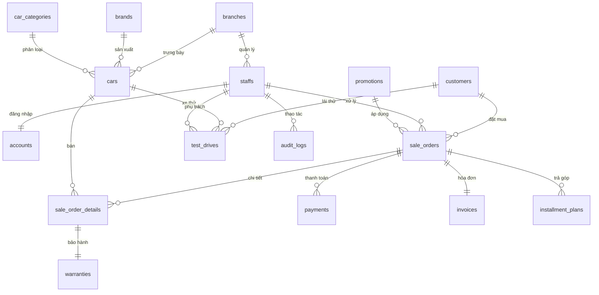

<p align="center">
  
  
  
  
  
</p>

<h1 align="center">🚗 Car Sales Management System</h1>

<p align="center">
  <strong>Hệ thống Quản lý Bán xe Ô tô</strong><br/>
  Ứng dụng desktop chuyên nghiệp quản lý toàn diện hoạt động showroom ô tô
</p>

<p align="center">
  <em>Đồ án cuối kỳ môn Ngôn Ngữ Lập Trình Tiên Tiến</em><br/>
  <em>Trường Đại học Công nghệ Kỹ thuật TP.HCM (UTE)</em>
</p>

---

## 👥 Nhóm 14 — Thành viên

| MSSV | Họ và Tên |
|:---:|:---|
| 23110305 | **Huỳnh Ngọc Tài** |
| 23110278 | **Bùi Phúc Nhân** |
| 23110198 | **Bùi Nhật Dương** |

---

## 📋 Mục lục

- [Tổng quan](#-tổng-quan)
- [Tính năng chính](#-tính-năng-chính)
- [Kiến trúc hệ thống](#-kiến-trúc-hệ-thống)
- [Công nghệ sử dụng](#-công-nghệ-sử-dụng)
- [Cơ sở dữ liệu](#-cơ-sở-dữ-liệu)
- [Cài đặt và Chạy](#-cài-đặt-và-chạy)
- [Tài khoản mẫu](#-tài-khoản-mẫu)
- [Cấu trúc dự án](#-cấu-trúc-dự-án)
- [Screenshots](#-screenshots)

---

## 🔍 Tổng quan

**Car Sales Management System (CarSalesMS)** là ứng dụng desktop Java Swing được thiết kế để quản lý toàn diện hoạt động kinh doanh của showroom ô tô. Hệ thống hỗ trợ **14 phân hệ nghiệp vụ** (F01–F15), bao phủ từ quản lý danh mục xe, quy trình bán hàng, thanh toán & trả góp, cho đến bảo hành, thống kê doanh thu và nhật ký hệ thống.

### Điểm nổi bật

- 🎨 **Giao diện hiện đại** — Sử dụng FlatLaf với bảng màu Premium Blue tùy chỉnh, sidebar navigation
- 🔐 **Phân quyền 2 cấp** — Admin (toàn quyền 14 modules) và Staff (10 modules theo phạm vi chi nhánh)
- 📊 **Dashboard thời gian thực** — KPI cards tự động cập nhật doanh thu, đơn hàng, lịch lái thử
- 📄 **Xuất hóa đơn PDF** — Tích hợp iText để xuất hóa đơn chuyên nghiệp
- 🛡️ **Audit Log** — Ghi lại mọi thao tác tạo/sửa/xóa trong hệ thống
- 💳 **Thanh toán linh hoạt** — Hỗ trợ tiền mặt, chuyển khoản, trả góp nhiều kỳ

---

## ✨ Tính năng chính

Hệ thống được chia thành **14 phân hệ chức năng**, phục vụ đầy đủ nghiệp vụ quản lý showroom ô tô:

| Mã | Phân hệ | Mô tả |
|:---:|:---|:---|
| F01 | **Đăng nhập & Phân quyền** | Xác thực SHA-256, khóa tài khoản khi nhập sai, phân quyền Admin/Staff |
| F02 | **Dashboard** | Tổng quan KPI: doanh thu tháng, đơn hàng hôm nay, lịch lái thử, danh sách công việc |
| F03 | **Quản lý Xe** | CRUD xe, hãng xe, loại xe; quản lý tồn kho, tra cứu nhanh theo mã/tên |
| F04 | **Quản lý Khách hàng** | Hồ sơ khách hàng, thông tin liên hệ, lịch sử giao dịch |
| F05 | **Quản lý Nhân viên & Tài khoản** | CRUD nhân viên, tạo/khóa/mở khóa tài khoản, đặt lại mật khẩu |
| F06 | **Quản lý Chi nhánh** | Thông tin chi nhánh, phân bổ xe và nhân viên theo chi nhánh |
| F07 | **Quản lý Khuyến mãi** | Chương trình giảm giá (theo % hoặc số tiền), thời hạn áp dụng |
| F08 | **Quản lý Đơn bán** | Tạo đơn, chọn xe/khách hàng/khuyến mãi, theo dõi trạng thái |
| F09 | **Ghi nhận Thanh toán** | Thanh toán tiền mặt, chuyển khoản, trả góp; theo dõi dư nợ |
| F10 | **Quản lý Hóa đơn** | Tự động phát hành hóa đơn, xuất PDF, tra cứu |
| F11 | **Quản lý Trả góp** | Lập kế hoạch trả góp, theo dõi kỳ thanh toán, ghi nhận thu tiền |
| F12 | **Quản lý Lái thử** | Đặt lịch, phân công nhân viên, cập nhật kết quả lái thử |
| F13 | **Quản lý Bảo hành** | Tự động kích hoạt bảo hành 3 năm, tra cứu trạng thái |
| F14 | **Thống kê & Báo cáo** | Doanh thu theo ngày/tháng/quý, top xe bán chạy, hiệu quả chi nhánh |
| F15 | **Nhật ký hệ thống** | Audit log ghi lại mọi thao tác: tạo/sửa/xóa, đăng nhập, thanh toán |

### Phân quyền theo vai trò

| Vai trò | Modules | Phạm vi |
|:---|:---|:---|
| **ADMIN** | Toàn bộ 14 modules (F01–F15) | Tất cả chi nhánh |
| **STAFF** | 10 modules (F01–F04, F08–F14) | Chỉ chi nhánh được phân công |

---

## 🏗️ Kiến trúc hệ thống

Dự án áp dụng kiến trúc **3 lớp (Three-tier Architecture)** kết hợp mô hình **MVC**, đảm bảo tách biệt rõ ràng giữa giao diện, nghiệp vụ và dữ liệu.

```
┌─────────────────────────────────────────────────────────┐
│                    Presentation Layer                    │
│  ┌──────────┐  ┌──────────────┐  ┌───────────────────┐  │
│  │LoginFrame│  │AdminDashboard│  │ StaffDashboard    │  │
│  └──────────┘  └──────────────┘  └───────────────────┘  │
│  ┌────────────────────────────────────────────────────┐  │
│  │           Component Panels (14 modules)            │  │
│  │  CarPanel │ CustomerPanel │ OrderPanel │ ...       │  │
│  └────────────────────────────────────────────────────┘  │
│  ┌────────────────────────────────────────────────────┐  │
│  │       Theme: UiPalette │ UiSizing │ LookAndFeel   │  │
│  └────────────────────────────────────────────────────┘  │
├─────────────────────────────────────────────────────────┤
│                    Business Layer                        │
│  ┌──────────────┐  ┌──────────────────────────────────┐  │
│  │  Controllers │  │  Services (Interface + Impl)     │  │
│  │  (12 files)  │  │  (34 files)                      │  │
│  └──────────────┘  └──────────────────────────────────┘  │
│  ┌────────────────────────────────────────────────────┐  │
│  │  Session: CurrentSession │ AuthSessionStore        │  │
│  └────────────────────────────────────────────────────┘  │
├─────────────────────────────────────────────────────────┤
│                      Data Layer                         │
│  ┌──────────────┐  ┌──────────────────────────────────┐  │
│  │  DAO (15     │  │  JPA Entities (14 tables)        │  │
│  │  interfaces) │  │  DTOs (30+ records)              │  │
│  │  + Impl      │  │  Enums (10 types)                │  │
│  └──────────────┘  └──────────────────────────────────┘  │
│  ┌────────────────────────────────────────────────────┐  │
│  │  JpaUtil ←→ Hibernate 6.4 ←→ MySQL 8              │  │
│  └────────────────────────────────────────────────────┘  │
└─────────────────────────────────────────────────────────┘
```

### Nguyên tắc thiết kế

| Nguyên tắc | Áp dụng |
|:---|:---|
| **Dependency Inversion (DIP)** | Service interfaces + Impl tách biệt, inject qua constructor |
| **Single Responsibility (SRP)** | Mỗi class có trách nhiệm rõ ràng (DAO, Service, Controller, View) |
| **Manual DI** | `AppLauncher` đóng vai trò Composition Root, wire toàn bộ dependency |
| **Record-based DTOs** | Sử dụng Java Record cho immutable data transfer objects |
| **Centralized Theme** | `UiPalette`, `UiSizing`, `LookAndFeelConfig` quản lý giao diện tập trung |

---

## 🛠️ Công nghệ sử dụng

| Thành phần | Công nghệ | Phiên bản |
|:---|:---|:---:|
| **Ngôn ngữ** | Java | 21 |
| **Build tool** | Apache Maven | 3.x |
| **ORM** | Hibernate ORM | 6.4.4 |
| **JPA API** | Jakarta Persistence | 3.1.0 |
| **CSDL** | MySQL | 8.x |
| **JDBC Driver** | MySQL Connector/J | 8.3.0 |
| **UI Framework** | Java Swing + FlatLaf | 3.5.4 |
| **PDF Export** | iText | 5.5.13 |
| **Mã hóa** | SHA-256 (java.security) | — |

---

## 🗄️ Cơ sở dữ liệu

Hệ thống sử dụng **MySQL 8+** với **14 bảng** được thiết kế chuẩn hóa, hỗ trợ UTF-8 (utf8mb4):



### Danh sách bảng

| Bảng | Mô tả |
|:---|:---|
| `branches` | Chi nhánh showroom |
| `brands` | Hãng xe (Toyota, Mazda, Kia, Hyundai...) |
| `car_categories` | Loại xe (Sedan, SUV, MPV) |
| `staffs` | Nhân viên (role: ADMIN/STAFF) |
| `accounts` | Tài khoản đăng nhập (SHA-256 password hash) |
| `customers` | Khách hàng |
| `cars` | Xe ô tô (import/sale price, tồn kho) |
| `promotions` | Chương trình khuyến mãi (% hoặc số tiền) |
| `sale_orders` | Đơn bán hàng |
| `sale_order_details` | Chi tiết đơn bán (xe, số lượng, đơn giá) |
| `payments` | Lịch sử thanh toán |
| `invoices` | Hóa đơn |
| `installment_plans` | Kế hoạch trả góp |
| `test_drives` | Lịch lái thử |
| `warranties` | Bảo hành |
| `audit_logs` | Nhật ký hệ thống |

---

## 🚀 Cài đặt và Chạy

### Yêu cầu hệ thống

| Yêu cầu | Chi tiết |
|:---|:---|
| **JDK** | Java 21 trở lên |
| **Maven** | 3.8+ (hoặc sử dụng Maven Wrapper có sẵn) |
| **MySQL** | 8.0 trở lên |
| **IDE** | IntelliJ IDEA (khuyên dùng) hoặc Eclipse |

### Bước 1: Clone dự án

```bash
git clone https://github.com/buiphucnhannn/CarSalesManagementSystem.git
cd CarSalesManagementSystem
```

### Bước 2: Tạo cơ sở dữ liệu

Mở MySQL client (MySQL Workbench, phpMyAdmin, CLI...) và chạy lần lượt:

```bash
# Tạo schema và các bảng
mysql -u root -p < database/01_create_database.sql

# Import dữ liệu mẫu
mysql -u root -p < database/02_insert_sample_data.sql
```

### Bước 3: Cấu hình kết nối

Mở file `src/main/resources/META-INF/persistence.xml` và cập nhật thông tin kết nối:

```xml
<property name="jakarta.persistence.jdbc.url"
          value="jdbc:mysql://localhost:3306/car_sales_ms?useSSL=false&amp;serverTimezone=Asia/Ho_Chi_Minh"/>
<property name="jakarta.persistence.jdbc.user"     value="root"/>
<property name="jakarta.persistence.jdbc.password"  value="your_password"/>
```

### Bước 4: Build và Chạy

```bash
# Build dự án
mvn clean compile

# Chạy ứng dụng
mvn exec:java -Dexec.mainClass="vn.edu.ute.carsalesms.AppLauncher"
```

Hoặc mở dự án bằng **IntelliJ IDEA** → chạy class `AppLauncher.java`.

---

## 🔑 Tài khoản mẫu

Dữ liệu mẫu đã bao gồm các tài khoản sẵn sàng sử dụng:

| Tài khoản | Mật khẩu | Vai trò | Chi nhánh |
|:---|:---|:---:|:---|
| `admin` | `admin1` | ADMIN | HCM District 1 Showroom |
| `admin2` | `admin2` | ADMIN | HCM District 7 Showroom |
| `nhanvien1` | `1234` | STAFF | HCM District 1 Showroom |
| `nhanvien2` | `1234` | STAFF | HCM District 7 Showroom |
| `nhanvien3` | `abcd` | STAFF | HCM District 1 Showroom |

> **Lưu ý:** Tài khoản `admin` và `staff01`, `staff02` sử dụng mã hóa SHA-256. Các tài khoản còn lại sử dụng plain-text (hệ thống tự nhận diện).

---

## 📁 Cấu trúc dự án

```
CarSalesMS/
├── 📂 database/
│   ├── 01_create_database.sql          # Schema DDL (14 bảng)
│   └── 02_insert_sample_data.sql       # Dữ liệu mẫu
├── 📂 docs/                            # Tài liệu bổ sung
├── 📂 uml/                             # Biểu đồ UML
├── 📂 src/main/
│   ├── 📂 java/vn/edu/ute/carsalesms/
│   │   ├── AppLauncher.java            # 🚀 Entry point + Composition Root
│   │   ├── 📂 config/
│   │   │   └── JpaUtil.java            # EntityManagerFactory singleton
│   │   ├── 📂 controller/             # 12 Controllers (điều phối UI ↔ Service)
│   │   │   ├── AuthController.java
│   │   │   ├── CarManagementController.java
│   │   │   ├── SaleOrderController.java
│   │   │   ├── PaymentController.java
│   │   │   └── ...
│   │   ├── 📂 dao/                    # 15 DAO Interfaces + Implementations
│   │   │   ├── CarDao.java
│   │   │   ├── SaleOrderDao.java
│   │   │   └── 📂 impl/              # Hibernate DAO implementations
│   │   ├── 📂 model/
│   │   │   ├── 📂 entity/            # 14 JPA Entities
│   │   │   │   ├── Car.java
│   │   │   │   ├── SaleOrder.java
│   │   │   │   ├── Customer.java
│   │   │   │   └── ...
│   │   │   ├── 📂 dto/               # 30+ Java Records (DTO)
│   │   │   │   ├── AuthenticatedUser.java
│   │   │   │   ├── AdminOverviewData.java
│   │   │   │   └── ...
│   │   │   └── 📂 enums/             # 10 Enums (trạng thái, vai trò...)
│   │   │       ├── StaffRole.java
│   │   │       ├── OrderStatus.java
│   │   │       └── ...
│   │   ├── 📂 service/               # Service Interfaces (SRP, DIP)
│   │   │   ├── AuthService.java
│   │   │   ├── CarService.java
│   │   │   ├── InvoicePdfExporter.java
│   │   │   └── 📂 impl/              # Service Implementations
│   │   ├── 📂 session/               # Quản lý phiên đăng nhập
│   │   │   ├── CurrentSession.java
│   │   │   └── UserSessionContext.java
│   │   ├── 📂 util/                  # Tiện ích
│   │   │   ├── PasswordUtil.java      # SHA-256 hashing
│   │   │   └── CodeGeneratorUtil.java # Auto-generate mã đơn hàng, xe...
│   │   └── 📂 view/                  # Giao diện Swing
│   │       ├── 📂 auth/              # Màn hình đăng nhập
│   │       ├── 📂 admin/             # Dashboard Admin (14 modules)
│   │       ├── 📂 staff/             # Dashboard Staff (10 modules)
│   │       ├── 📂 component/         # UI Components tái sử dụng
│   │       │   ├── SidebarMenuPanel.java
│   │       │   ├── StatCardPanel.java
│   │       │   ├── CarManagementPanel.java
│   │       │   └── ... (14 panels)
│   │       └── 📂 theme/             # Design System
│   │           ├── UiPalette.java     # Bảng màu Premium Blue
│   │           ├── UiSizing.java      # Kích thước chuẩn
│   │           ├── LookAndFeelConfig.java
│   │           └── DialogUiUtil.java
│   └── 📂 resources/META-INF/
│       └── persistence.xml            # Cấu hình JPA/Hibernate
└── pom.xml                            # Maven dependencies
```

---

## 📸 Screenshots

> Ứng dụng sử dụng giao diện FlatLaf hiện đại với bảng màu Premium Blue tùy chỉnh.

### Màn hình Đăng nhập
- Thiết kế split-panel: branding gradient bên trái + form đăng nhập bên phải
- Hỗ trợ ẩn/hiện mật khẩu, gradient button với hover animation

### Dashboard Admin
- 4 KPI cards: Doanh thu tháng, Đơn bán hôm nay, Khách chờ tư vấn, Lịch lái thử
- Bảng đơn bán gần nhất
- Sidebar navigation 14 modules

### Dashboard Staff
- 4 KPI cards: Đơn cần xử lý, Doanh thu hôm nay, Lịch lái thử, Bảo hành mở
- Danh sách công việc hôm nay + Lịch trình timeline

---

## 📄 License

Dự án này được phát triển phục vụ mục đích học tập tại **Trường Đại học Công nghệ Kỹ thuật TP.HCM (UTE)**.

---

<p align="center">
  <strong>Nhóm 14</strong> — Ngôn Ngữ Lập Trình Tiên Tiến — UTE © 2026
</p>
